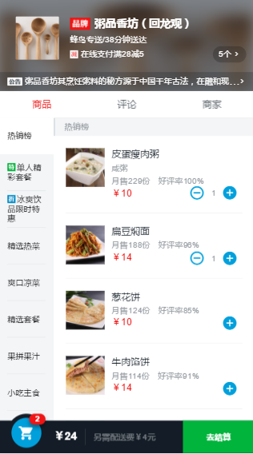
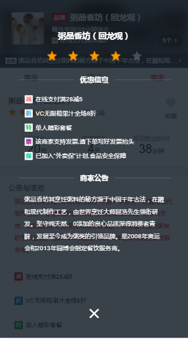

###vue2.0仿饿了么app

####使用的技术
1.该项目使用vue-cli搭建而成 
2.项目中使用了vue2.0，vue-router，vue-resource 
3.使用了ES6语法 
4.采用flex布局 

####项目介绍
1.该项目由四大组件构成：header组件，goods组件，ratings组件，seller组件。 
2.header组件中实现了弹窗功能。商品，评论，商家之间可以进行相互切换。 
3.实现了购物车功能，并且添加商品时具有动画效果。 
4.使用vue实现数据的动态获取，动态更新页面数据 

####效果图

|  |  |

